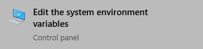
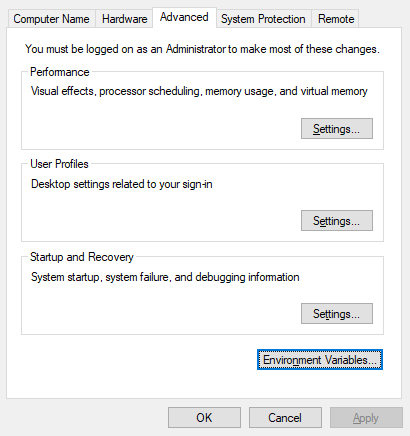
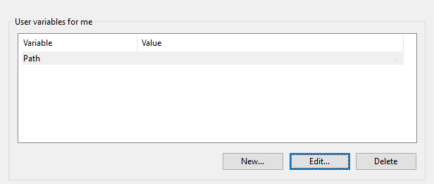

import Tabs from "@theme/Tabs";
import TabItem from "@theme/TabItem";

# Tooling setup

## Getting the npm package

To install Rostar, make sure [Node.js](https://nodejs.org) is set up. After that, it can installed by getting the [`rostar`](https://npmjs.com/package/rostar) package:

```bash
npm install -g rostar
```

Running the command with the `-g` argument is recommended, and allows you to run `rostar` from any location in your console.

## Installing Rojo and Remodel

It is recommended to use [Foreman](https://github.com/Roblox/foreman) for managing Rostar's required tools - [Rojo](https://github.com/rojo-rbx/rojo) and [Remodel](https://github.com/rojo-rbx/remodel). Foreman can be installed through [cargo](https://crates.io/crates/foreman) or by getting the binary files inside your system PATH.

:::note
Foreman may be replaced by [Aftman](https://github.com/LPGhatguy/aftman) in the future.
:::

### Setting up Foreman

<Tabs groupId="operating-systems">

<TabItem value="windows" label="Windows">

1. Open the "Edit the system environment variables" application.

    

2. Select "Environment Variables...".

    

3. Under the "User variables for me" section, select "Path" and click "Edit...".

    

4. In the menu that opens, click "New".

    

5. Add the `C:\Users\<My username>\.foreman\bin\` directory.

6. Create the `C:\Users\<My username>\.foreman\bin\` directory:

    ```shell
    mkdir %userprofile%\.foreman\bin
    ```

7. Download the Foreman archive specific to your OS from the [releases on GitHub](https://github.com/Roblox/foreman/releases/latest).
8. Unzip the archive and place the executable in the `C:\Users\<My username>\.foreman\bin\` directory.

</TabItem>

<TabItem value="mac" label="MacOS">

1. Open or create the `~/.zshrc` file and add `:/Users/<My username>/.foreman/bin` to the end of the `PATH=` line. If this line doesn't exist add a new line with the contents:
    ```bash
    PATH=/Users/<My username>/.foreman/bin
    ```
2. Download the Foreman archive specific to your OS from the [releases on GitHub](https://github.com/Roblox/foreman/releases/latest).
3. Unzip the archive and place the executable in `/usr/local/bin/`.

</TabItem>

<TabItem value="linux" label="Linux">

1. Depending on the shell, the `PATH` variable will have to be appended `/home/<My username>/.foreman/bin`.
2. Download the Foreman archive specific to your OS from the [releases on GitHub](https://github.com/Roblox/foreman/releases/latest).
3. Unzip the archive and place the executable in `/usr/local/bin/`.

</TabItem>

</Tabs>
